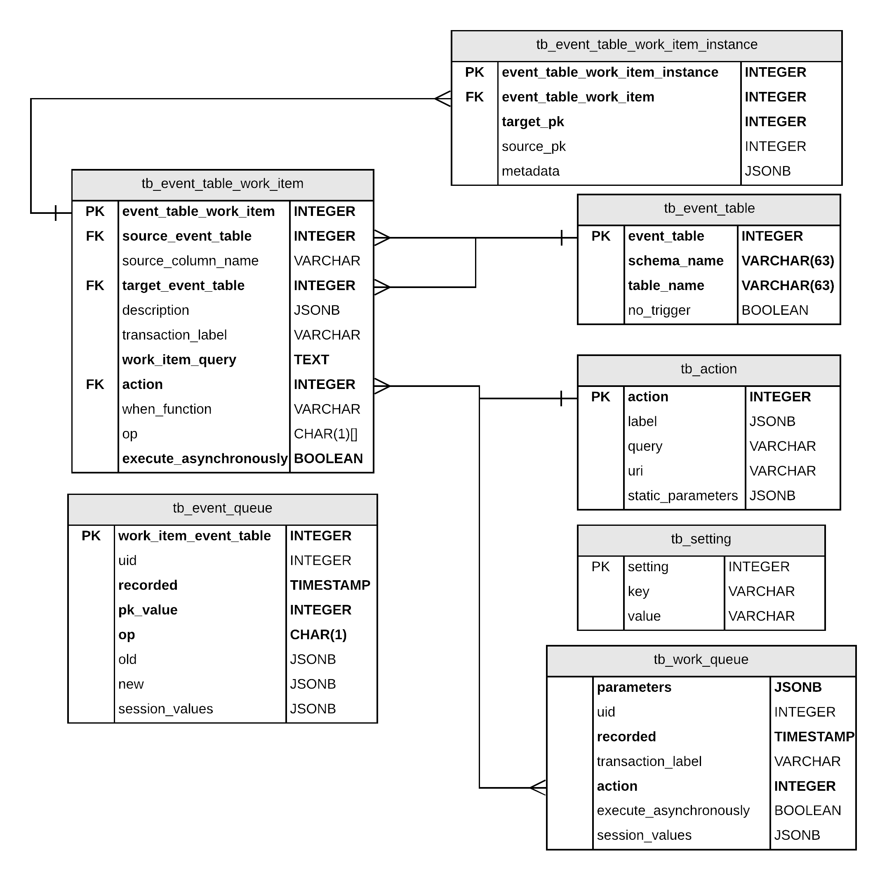

Event Manager
=============

# Summary

Event Manager (event_manager) is a PostgreSQL extension that implements a loosly-coupled event triggering system.

Event Manager consists of two processing loops handing events and work, respectively.

Events can be processed either synchronously or asynchronously in both stages of processing, independently.

# Usage

For more information on using this extension, see docs/usage.md

## Events

Events can be 'subscribed to' by inserting the table into tb_event_table and creating at least one tb_event_table_work_item for that table.

When DML occurs on that table (an event), the work item entries for that event table are executed. These potential queue elements are optionally filtered by a function that can determine whether these events apply to this specific work item.

Work item queries are expected to generate one or more rows of JSONB aliased as 'parameters' which are fed into the action. Along with these parameters, the original event's transaction timestamp and other datapoints will be made available to the action.

## Event Query (work_item_query)

This query gathers the dynamic arguments for the following Action, and together with optional session and static parameters, form the full argument list for the action.

## Actions

Actions are either local database modification or remote API calls that happen after an event is processed. Parameters for these calls are gathered from the action's static parameter list, as well as the results from the work item query, or static parameters stored with the action. Results of actions are currently discarded.

# Schema

## Requirements:
* PostgreSQL 9.6+
* gcc
* libcurl
* PostgreSQL development packages
  * postgresql<version>-devel for CentOS / RHEL
  * libpq-dev and postgresql-server-dev-<version> for Debian / Ubuntu
* Valgrind (optional)

## Installation
1. Checkout the event_manager source from github
2. Ensure that pg_config is in the user's path
3. Follow installation guide in docs/setup.md for setting up and checking prerequisites
4. Run make to compile the event_manager executable
5. As superuser, run 'make install' with event_manager in your current directory
6. Log into the database server
7. Run 'CREATE EXTENSION event_manager;'
8. Start the event_manager program with connection parameters to your target DB server/instance.

## Changelog

### Version 0.1
Initial Version
